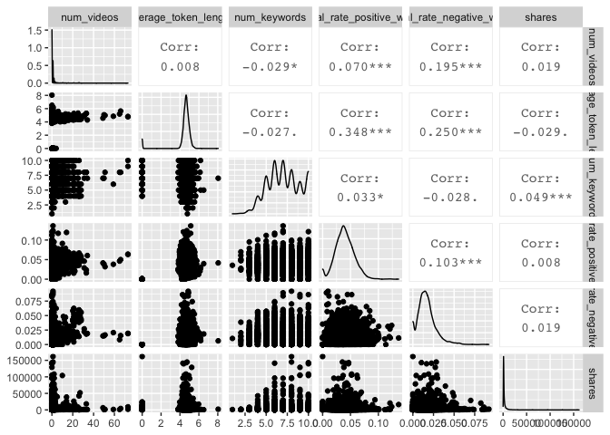

Project 2 - ST 558 - CM Heubusch 2
================
July 3, 2020

# Introduction

## Purpose of Analysis

The [**Online News Popularity** data
set](https://archive.ics.uci.edu/ml/datasets/Online+News+Popularity#)
describes two years’ worth of articles that were published on
[Mashable](https://mashable.com/). The purpose of this analysis is to
create linear and ensemble models by which we can best predict the
number of shares an article on the website will receive. Mashable staff
and other online publishers may be interested in this data, as it could
help them determine what kind of content will be most popular.

## Methods Used

For this project, I first examined the data with summary statistics,
looking for correlations between the target variable of **shares** and
the predictor variables. These helped determine which variables I wanted
to experiment with when it came to my linear models. Though it was not
explicitly part of the class material, I also created a separate model,
based upon which variables

I then utilized the `caret` package to create a random forest. Per the
class notes, the random forest method help us obtain a “more corrlated”
version of bagged tree predictions, ensuring that a hypothetical really
strong predictor doesn’t wind up in every bootstrap tree. With this
method, we might NOT use all predictors - instead, it’ll be “a random
subset of predictors for each bootstrap sample/tree fit”.

## Describing the Data & Variables

In total, the data set consists of 39,644 observations, with 61 columns
of different variables. In examining the variables, I was particularly
intrigued by the following, simply based upon my limited knowledge of
the media industry:  
\* n\_tokens\_title - *“number of words in the title”*  
\* n\_tokens\_content - *“number of words in the content”*  
\* num\_hrefs - *“number of links” in the article*  
\* num\_imgs - *“number of images”*  
\* num\_videos - *“number of videos”*  
\* average\_token\_length - *average word length in the article* \*
num\_keywords - *how many keywords are included in the metadata, an
important factor for search engine optimization* \*
data\_channel\_is\_\* variables - *six binary variables, indicating
whether the observation is included in a particular channel. Each
article appears to only be attributed to either one channel, or no
channel/another channel (perhaps smaller) that was not accounted for
with these binary variables*  
\* global\_rate\_positive\_words - *“rate of positive words in the
content,” or rather, the ratio of positive:total words in the article*  
\* global\_rate\_negative\_words - *“rate of negative words in the
content,” the complement to global\_rate\_positive\_words*

The **weekday\_is\_** variables will be our means of creating seven
separate reports. They are binary variables, so their value is either 0
(for No, not published that day of the week) or 1 (Yes, published that
day). **weekday\_is\_weekend** is 1 if the article was published on
*either* Saturday or Sunday.

# Reading in the Dataset

``` r
newsData <- read.csv(file="/Users/christinemarieheubusch/Project-2/OnlineNewsPopularity/OnlineNewsPopularity.csv")
#Removing URL and timedelta columns, since these variables are non-predictive.
newsData <- newsData %>% select(-url, -timedelta)
#str(newsData)
head(newsData)
```

    ##   n_tokens_title n_tokens_content n_unique_tokens n_non_stop_words
    ## 1              8             2509       0.3488781                1
    ## 2             13             1629       0.4257106                1
    ## 3             11              223       0.6531531                1
    ## 4             11              346       0.5290520                1
    ## 5             12              328       0.6962963                1
    ## 6             10              442       0.5163551                1
    ##   n_non_stop_unique_tokens num_hrefs num_self_hrefs num_imgs num_videos
    ## 1                0.4649235        23              1       10          0
    ## 2                0.6060924        15             12        6          0
    ## 3                0.8257576         5              3        1          0
    ## 4                0.6847826         9              7        1          1
    ## 5                0.8850575         9              7        3         48
    ## 6                0.6441281        24              1       12          1
    ##   average_token_length num_keywords data_channel_is_lifestyle
    ## 1             4.569550           10                         1
    ## 2             4.552486            8                         0
    ## 3             4.923767            6                         0
    ## 4             4.523121            8                         0
    ## 5             4.405488            7                         0
    ## 6             5.076923            8                         0
    ##   data_channel_is_entertainment data_channel_is_bus data_channel_is_socmed
    ## 1                             0                   0                      0
    ## 2                             1                   0                      0
    ## 3                             0                   1                      0
    ## 4                             0                   0                      0
    ## 5                             0                   0                      1
    ## 6                             0                   0                      0
    ##   data_channel_is_tech data_channel_is_world kw_min_min kw_max_min kw_avg_min
    ## 1                    0                     0         -1        646    152.300
    ## 2                    0                     0         -1       1100    354.000
    ## 3                    0                     0         -1        459     91.000
    ## 4                    1                     0         -1        671    173.125
    ## 5                    0                     0         -1        616    184.000
    ## 6                    0                     0         -1        691    168.250
    ##   kw_min_max kw_max_max kw_avg_max kw_min_avg kw_max_avg kw_avg_avg
    ## 1      31000     843300   275140.0   2990.745   6880.687   4349.053
    ## 2       1500     843300   200800.0   1300.000   4288.894   2746.804
    ## 3          0     843300   484083.3      0.000   4301.332   2665.713
    ## 4      26900     843300   374962.5   2514.743   4004.343   3031.116
    ## 5       6500     843300   192985.7   1664.268   5470.169   3411.661
    ## 6       6200     843300   295850.0   1753.882   6880.687   4206.439
    ##   self_reference_min_shares self_reference_max_shares
    ## 1                      4900                      4900
    ## 2                       857                     16900
    ## 3                      2000                      5700
    ## 4                     11400                     48000
    ## 5                      2100                      2100
    ## 6                      1400                      1400
    ##   self_reference_avg_sharess weekday_is_monday weekday_is_tuesday
    ## 1                   4900.000                 0                  0
    ## 2                   5181.417                 0                  0
    ## 3                   3633.333                 0                  0
    ## 4                  37033.333                 0                  0
    ## 5                   2100.000                 0                  0
    ## 6                   1400.000                 0                  0
    ##   weekday_is_wednesday weekday_is_thursday weekday_is_friday
    ## 1                    1                   0                 0
    ## 2                    1                   0                 0
    ## 3                    1                   0                 0
    ## 4                    1                   0                 0
    ## 5                    1                   0                 0
    ## 6                    1                   0                 0
    ##   weekday_is_saturday weekday_is_sunday is_weekend     LDA_00     LDA_01
    ## 1                   0                 0          0 0.16555103 0.02001286
    ## 2                   0                 0          0 0.02500044 0.76894522
    ## 3                   0                 0          0 0.55133809 0.03333719
    ## 4                   0                 0          0 0.02503777 0.02500062
    ## 5                   0                 0          0 0.02934870 0.02857493
    ## 6                   0                 0          0 0.15900446 0.02502466
    ##       LDA_02     LDA_03     LDA_04 global_subjectivity
    ## 1 0.02000092 0.35418710 0.44024809           0.4835354
    ## 2 0.02548047 0.15557371 0.02500016           0.4401519
    ## 3 0.03334721 0.03333504 0.34864248           0.5520408
    ## 4 0.15170116 0.02500011 0.77326035           0.4826786
    ## 5 0.23186607 0.68163487 0.02857542           0.5643743
    ## 6 0.02520734 0.64379353 0.14697000           0.5102958
    ##   global_sentiment_polarity global_rate_positive_words
    ## 1                0.07970628                 0.02670387
    ## 2                0.10542398                 0.04665439
    ## 3                0.26887755                 0.03139013
    ## 4                0.14196429                 0.03757225
    ## 5                0.19424931                 0.03963415
    ## 6                0.02460859                 0.03393665
    ##   global_rate_negative_words rate_positive_words rate_negative_words
    ## 1                0.021123954           0.5583333           0.4416667
    ## 2                0.020871700           0.6909091           0.3090909
    ## 3                0.004484305           0.8750000           0.1250000
    ## 4                0.014450867           0.7222222           0.2777778
    ## 5                0.009146341           0.8125000           0.1875000
    ## 6                0.024886878           0.5769231           0.4230769
    ##   avg_positive_polarity min_positive_polarity max_positive_polarity
    ## 1             0.3518708            0.10000000                  1.00
    ## 2             0.4595395            0.03333333                  1.00
    ## 3             0.5734694            0.21428571                  0.80
    ## 4             0.3337912            0.10000000                  0.75
    ## 5             0.3748252            0.13636364                  0.70
    ## 6             0.3072727            0.13636364                  0.50
    ##   avg_negative_polarity min_negative_polarity max_negative_polarity
    ## 1            -0.2316115                 -0.60            -0.0500000
    ## 2            -0.4295343                 -1.00            -0.0500000
    ## 3            -0.2500000                 -0.25            -0.2500000
    ## 4            -0.2600000                 -0.50            -0.1250000
    ## 5            -0.2111111                 -0.40            -0.1000000
    ## 6            -0.3564394                 -0.80            -0.1666667
    ##   title_subjectivity title_sentiment_polarity abs_title_subjectivity
    ## 1          0.0000000                0.0000000             0.50000000
    ## 2          0.7833333               -0.6000000             0.28333333
    ## 3          0.0000000                0.0000000             0.50000000
    ## 4          0.1000000                0.0000000             0.40000000
    ## 5          0.3000000                1.0000000             0.20000000
    ## 6          0.4545455                0.1363636             0.04545454
    ##   abs_title_sentiment_polarity shares
    ## 1                    0.0000000   1700
    ## 2                    0.6000000   1400
    ## 3                    0.0000000   1200
    ## 4                    0.0000000   1800
    ## 5                    1.0000000   1900
    ## 6                    0.1363636   1900

## Creating New Column Using `Mutate`

I was intrigued by the **data\_channel\_is\_** columns in the set, so I
decided to figure out a way to combine these columns into a single
**channel** column with the `mutate()`function. Working off a
[StackOverflow
example](https://stackoverflow.com/questions/55126134/nested-ifelse-statement-with-multiple-columns),
I used
[`dplyr::case_when`](https://www.rdocumentation.org/packages/dplyr/versions/0.7.8/topics/case_when)
to assign values based upon the values within the from the six
**data\_channel\_is\_** columns.

I then realized that not every article was associated with a channel; so
I used the [`replace_na()`
function](https://tidyr.tidyverse.org/reference/replace_na.html) from
the `tidyr` package to replace NAs with “Other”. (This is an assumption
on my end - it’s possible that some articles are not assigned to any
channel.)

I finished this by converting the values of the **channel** column to
factors, removing the URL column (since it will not be used in any
calculations), and removed the old **data\_channel\_is\_** columns, for
a new total of 55 columns for the dataset. I can now use this column for
categorical variables.

``` r
newsData <- newsData %>% 
            mutate(channel = case_when(
               data_channel_is_bus == 1 ~ "Business",
               data_channel_is_entertainment == 1 ~ "Entertainment",
               data_channel_is_lifestyle == 1 ~ "Lifestyle",
               data_channel_is_socmed == 1 ~ "SocialMedia",
               data_channel_is_tech == 1 ~ "Tech",
               data_channel_is_world == 1 ~ "World"
               ))
newsData$channel <- replace_na(newsData$channel, "Other")
newsData$channel <- as.factor(newsData$channel) #Converting to factor
view(newsData)
```

``` r
newsData <- newsData %>% filter(weekday_is_tuesday==1) #Original filtering for just Monday data.
#newsData <- filter(newsData, (params$day==1))
```

Per the project directions, I began by splitting the data, using
`sample()`, with 70% of the data going to the training set (4,662
observations, **newsDataTrain**) and 30% going to the test set (1,999
observations, **newsDataTest**).

``` r
set.seed(789) #Setting seed to make it reproducible
train <- sample(1:nrow(newsData), size=nrow(newsData)*0.7)
test <- dplyr::setdiff(1:nrow(newsData), train)
newsDataTrain <- newsData[train,]
newsDataTest <- newsData[test,]
#view(newsDataTrain)
#view(newsDataTest)
```

Now let’s see if any of the variables that intrigued me should be
included in my multiple linear regression.

# Summarizations

*You should produce some basic (but meaningful) summary statistics about
the training data you are working with. The GENERAL things that the
plots describe should be explained but, since we are going to automate
things, there is no need to try and explain particular trends in the
plots you see (unless you want to try and automate that too\!).*

## Calculating Summary Statistics for Variables

I then used the `summary()` function to calculate summary statistics for
each of the quantitative variables in the dataset, including Min, 1st
Quartile, Median, Mean, 3rd Quartile, and Max. For the one categorical
variable I created (**channel**), it has calculated the frequency of
each type of channel.

I further explored the data by looking at a correlations plot with the
variables I had expressed interest in previously. I divided the
variables into different chunks, to make the plots easier to view. I
excluded **weekday\_is** variables, as I felt they would only be used
for the final creation of the reports, as opposed to being involved in
the model. I used the code from our notes *(Module 7 - Summarizing
Data/Quantitative Summaries)* for this purpose. \#\# Creating First
Correlation Plot with First 10 Variables

``` r
newsCorrelation1 <- cor(newsDataTrain[,c(1:10, 59)])
corrplot(newsCorrelation1, type="upper", method="number", tl.pos="lt", number.cex=0.5)
corrplot(newsCorrelation1, type="lower", add=TRUE, tl.pos="n", number.cex=0.5)
```

<!-- -->

## Creating Second Correlation Plot with Other Variables

``` r
newsCorrelation2 <- cor(newsDataTrain[,c(11:20, 59)])
corrplot(newsCorrelation2, type="upper", method="number", tl.pos="lt", number.cex=0.5)
corrplot(newsCorrelation2, type="lower", add=TRUE, tl.pos="n", number.cex=0.5)
```

<!-- -->

## Creating Third Correlation Plot

``` r
newsCorrelation3 <- cor(newsDataTrain[,c(21:28, 59)]) #excluding "weekday_is variables"
corrplot(newsCorrelation3, type="upper", method="number", tl.pos="lt", number.cex=0.5)
corrplot(newsCorrelation3, type="lower", add=TRUE, tl.pos="n", number.cex=0.5)
```

<!-- -->

## Creating Fourth Correlation Plot

``` r
newsCorrelation4 <- cor(newsDataTrain[,c(38:47, 59)]) #excluding "weekday_is" variables
corrplot(newsCorrelation4, type="upper", method="number", tl.pos="lt", number.cex=0.5)
corrplot(newsCorrelation4, type="lower", add=TRUE, tl.pos="n", number.cex=0.5)
```

<!-- -->

## Creating Fifth Correlation Plot

``` r
newsCorrelation5 <- cor(newsDataTrain[,c(48:58, 59)]) #excluding "weekday_is" variables
corrplot(newsCorrelation5, type="upper", method="number", tl.pos="lt", number.cex=0.5)
corrplot(newsCorrelation5, type="lower", add=TRUE, tl.pos="n", number.cex=0.5)
```

<!-- -->

## Creating Extra Correlation Plot

I also created an extra correlation plot, to examine some variables that
I had taken an interest in, where I thought there could be relationships
between the predictor variables. I thought these would be of interest,
as perhaps the number of keywords in the metadata would affect
likelihood of someone finding the article through SEO (and then sharing
it); or maybe social media users would gravitate towards longer/shorter
titles, longer/shorter articles, longer/short words, articles with more
negative words, and/or articles that have more links, images, or videos.

``` r
newsCorrelation6 <- cor(newsDataTrain[,c("num_keywords", "n_tokens_title","n_tokens_content", "num_hrefs", "num_imgs", "num_videos", "average_token_length", "num_keywords", "global_rate_positive_words", "global_rate_negative_words", "shares")])
corrplot(newsCorrelation6, type="upper", method="number", tl.pos="lt", number.cex=0.5)
corrplot(newsCorrelation6, type="lower", add=TRUE, tl.pos="n", number.cex=0.5)
```

<!-- -->

Unfortunately,looking at these six plots, I do not see a substantial
relationship between any one variable and the target variable of
**shares** - those low values all appear faded on the correlation plots,
representing weak relationships. However, with my final plot I do note
some correlation between other variables, suggesting that there may be
interactions between them. For example, the highest correlation
coefficient value is r=0.45, when looking at num\_hrefs and
n\_tokens\_content. This does seem to make practical sense; the more
words you have, the more likely you’ll need to include more links.
Perhaps less intuitive is the relationship between num\_imgs and
num\_hrefs, with the second-highest correlation coefficient of r=0.36.

I then created a boxplot showing the shares, classified by the
categorical variable of channel that I had created. The summary data
(which included all channels) indicated that the median number of shares
was around 1400 shares per article, though numerous outliers skew this
significantly, so that the mean was 3436 shares. Looking at the plots,
there do not seem to be dramatic differences in the data based upon
which channel an article has been classified under.

``` r
channelsBoxplot <- ggplot(newsDataTrain, aes(x=channel, y=shares))
channelsBoxplot + geom_boxplot()
```

<!-- -->

## Creating `ggpairs` Plots

I also created two sets of ggpairs plots, to look at possible
relationships in a different way. I again used the variables I looked at
in the sixth correlation plot from above.

``` r
newsDataTrain %>% select("num_keywords", "n_tokens_title","n_tokens_content", "num_hrefs", "num_imgs", "shares") %>% ggpairs()
```

<!-- -->

``` r
newsDataTrain %>% select("num_videos", "average_token_length", "num_keywords", "global_rate_positive_words", "global_rate_negative_words", "shares") %>% ggpairs()
```

<!-- -->

# Modeling

## Multiple Linear Regression

To begin, I wanted to first establish a better understanding of what the
model would look like if I was to incorporate ALL main effects,
excluding any interactions or quadratic terms.

### Creating Model with All Main Effects

``` r
dataFitAll <- lm(shares~., data=newsDataTrain) 
summary(dataFitAll)
```

    ## 
    ## Call:
    ## lm(formula = shares ~ ., data = newsDataTrain)
    ## 
    ## Residuals:
    ##    Min     1Q Median     3Q    Max 
    ## -27151  -2137  -1003    229 205000 
    ## 
    ## Coefficients: (14 not defined because of singularities)
    ##                                 Estimate Std. Error t value Pr(>|t|)    
    ## (Intercept)                    4.612e+06  6.197e+06   0.744 0.456785    
    ## n_tokens_title                 1.394e+02  5.366e+01   2.599 0.009380 ** 
    ## n_tokens_content               8.808e-01  3.950e-01   2.230 0.025796 *  
    ## n_unique_tokens                1.994e+02  3.595e+03   0.055 0.955779    
    ## n_non_stop_words              -5.971e+03  6.030e+03  -0.990 0.322084    
    ## n_non_stop_unique_tokens       2.260e+03  3.017e+03   0.749 0.453714    
    ## num_hrefs                      1.690e+01  1.143e+01   1.479 0.139247    
    ## num_self_hrefs                -5.022e+01  3.673e+01  -1.367 0.171593    
    ## num_imgs                       3.871e+01  1.722e+01   2.247 0.024651 *  
    ## num_videos                    -9.476e-01  3.019e+01  -0.031 0.974962    
    ## average_token_length          -1.750e+02  4.530e+02  -0.386 0.699354    
    ## num_keywords                   1.484e+01  6.964e+01   0.213 0.831301    
    ## data_channel_is_lifestyle      2.075e+03  7.840e+02   2.647 0.008137 ** 
    ## data_channel_is_entertainment  3.463e+02  4.914e+02   0.705 0.480974    
    ## data_channel_is_bus            1.331e+03  7.184e+02   1.853 0.063919 .  
    ## data_channel_is_socmed         1.737e+03  7.020e+02   2.474 0.013395 *  
    ## data_channel_is_tech           1.447e+03  7.124e+02   2.031 0.042276 *  
    ## data_channel_is_world          1.437e+03  7.216e+02   1.991 0.046534 *  
    ## kw_min_min                     7.972e-02  3.347e+00   0.024 0.980996    
    ## kw_max_min                    -3.099e-02  1.257e-01  -0.246 0.805306    
    ## kw_avg_min                    -1.211e-01  8.404e-01  -0.144 0.885478    
    ## kw_min_max                    -5.476e-03  2.198e-03  -2.491 0.012769 *  
    ## kw_max_max                    -9.318e-04  1.193e-03  -0.781 0.434699    
    ## kw_avg_max                    -2.632e-05  1.560e-03  -0.017 0.986537    
    ## kw_min_avg                    -4.867e-01  1.419e-01  -3.430 0.000607 ***
    ## kw_max_avg                    -2.489e-01  4.707e-02  -5.289 1.28e-07 ***
    ## kw_avg_avg                     2.083e+00  2.745e-01   7.588 3.82e-14 ***
    ## self_reference_min_shares      1.854e-02  2.068e-02   0.896 0.370039    
    ## self_reference_max_shares     -1.221e-02  1.161e-02  -1.051 0.293336    
    ## self_reference_avg_sharess     3.139e-02  3.062e-02   1.025 0.305369    
    ## weekday_is_monday                     NA         NA      NA       NA    
    ## weekday_is_tuesday                    NA         NA      NA       NA    
    ## weekday_is_wednesday                  NA         NA      NA       NA    
    ## weekday_is_thursday                   NA         NA      NA       NA    
    ## weekday_is_friday                     NA         NA      NA       NA    
    ## weekday_is_saturday                   NA         NA      NA       NA    
    ## weekday_is_sunday                     NA         NA      NA       NA    
    ## is_weekend                            NA         NA      NA       NA    
    ## LDA_00                        -4.615e+06  6.197e+06  -0.745 0.456489    
    ## LDA_01                        -4.615e+06  6.197e+06  -0.745 0.456513    
    ## LDA_02                        -4.616e+06  6.197e+06  -0.745 0.456423    
    ## LDA_03                        -4.614e+06  6.197e+06  -0.745 0.456549    
    ## LDA_04                        -4.615e+06  6.197e+06  -0.745 0.456502    
    ## global_subjectivity            4.040e+03  1.587e+03   2.546 0.010917 *  
    ## global_sentiment_polarity     -4.044e+03  3.206e+03  -1.261 0.207193    
    ## global_rate_positive_words     1.335e+04  1.401e+04   0.952 0.340960    
    ## global_rate_negative_words    -5.468e+04  2.753e+04  -1.986 0.047111 *  
    ## rate_positive_words            7.223e+02  5.564e+03   0.130 0.896713    
    ## rate_negative_words            4.650e+03  5.764e+03   0.807 0.419822    
    ## avg_positive_polarity          1.068e+03  2.567e+03   0.416 0.677393    
    ## min_positive_polarity          4.262e+02  2.199e+03   0.194 0.846327    
    ## max_positive_polarity          3.694e+02  7.901e+02   0.468 0.640101    
    ## avg_negative_polarity          1.046e+02  2.367e+03   0.044 0.964752    
    ## min_negative_polarity         -6.235e+01  8.665e+02  -0.072 0.942641    
    ## max_negative_polarity         -2.210e+03  1.955e+03  -1.130 0.258409    
    ## title_subjectivity            -7.174e+02  5.057e+02  -1.419 0.156055    
    ## title_sentiment_polarity       9.861e+02  4.687e+02   2.104 0.035419 *  
    ## abs_title_subjectivity         4.656e+02  6.775e+02   0.687 0.491923    
    ## abs_title_sentiment_polarity   8.830e+02  7.305e+02   1.209 0.226808    
    ## channelEntertainment                  NA         NA      NA       NA    
    ## channelLifestyle                      NA         NA      NA       NA    
    ## channelOther                          NA         NA      NA       NA    
    ## channelSocialMedia                    NA         NA      NA       NA    
    ## channelTech                           NA         NA      NA       NA    
    ## channelWorld                          NA         NA      NA       NA    
    ## ---
    ## Signif. codes:  0 '***' 0.001 '**' 0.01 '*' 0.05 '.' 0.1 ' ' 1
    ## 
    ## Residual standard error: 7715 on 5122 degrees of freedom
    ## Multiple R-squared:  0.05995,    Adjusted R-squared:  0.05078 
    ## F-statistic: 6.533 on 50 and 5122 DF,  p-value: < 2.2e-16

The Adjusted R-square values is a very low **0.05065**, but I do see
that the F-statistic is 6.075, with a very small p-value; it appears
that the F-test is significant, in turn suggesting that the model is
significant. With an alpha value of 0.01, the following variables are
considered significant: \* n\_tokens\_title  
\* num\_hrefs  
\* num\_imgs  
\* average\_token\_length  
\* kw\_avg\_max \* kw\_min\_avg \* kw\_max\_avg  
\* kw\_avg\_avg \* LDA\_00  
\* global\_subjectivity  
\* min\_positive\_polarity  
\* data\_channel\_is\_lifestyle  
\* data\_channel\_is\_entertainment  
\* data\_channel\_is\_bus  
\* data\_channel\_is\_socmed  
\* data\_channel\_is\_tech  
\* data\_channel\_is\_world

**However**, since we have not focused on this tactic for selecting
variables, I decided to forgo this particular approach, and focus
instead upon the correlations that I found in my summarization above.
Though all these corrlations were very weak, I’m going to experiment
with several different combinations of variables that exhibited the
highest correlations to our target variable of shares. I tried not to
include variables that were related or otherwise correlated with one
another, such as min\_negative\_polarity or max\_negative\_polarity; in
this case, I instead just chose to include avg\_negative\_polarity.

The variables, in descending correlation coefficient, were as follows:
\* LDA\_03, with a correlation coefficient of 0.07  
\* avg\_negative\_polarity, -0.06  
\* kw\_avg\_max, 0.06  
\* LDA\_02, -0.05  
\* data\_channel\_is\_world, -0.04 … *For now, I decided * num\_hrefs,
0.032  
\* average\_token\_length, -0.030  
\* global\_subjectivity, 0.030  
\* LDA\_04, -0.030  
\* num\_videos, 0.028  
\* num\_imgs, 0.023

### Creating Linear Regression Models

I created linear regression models, adding one variable at a time.

``` r
dataFit1 <- lm(shares~LDA_03, 
               data=newsDataTrain)
dataFit2 <- lm(shares~LDA_03 +
                 avg_negative_polarity,
               data=newsDataTrain)
dataFit3 <- lm(shares~LDA_03 +
                 avg_negative_polarity +
                 avg_negative_polarity,
               data=newsDataTrain)
dataFit4 <- lm(shares~LDA_03 +
                 avg_negative_polarity +
                 avg_negative_polarity + 
                 kw_avg_max,
               data=newsDataTrain)
dataFit5 <- lm(shares~LDA_03 +
                 avg_negative_polarity +
                 avg_negative_polarity + 
                 kw_avg_max +
                 LDA_02,
               data=newsDataTrain)
dataFit6 <- lm(shares~LDA_03 +
                 avg_negative_polarity +
                 avg_negative_polarity + 
                 kw_avg_max +
                 LDA_02 +
                 num_hrefs,
               data=newsDataTrain)
dataFit7 <- lm(shares~LDA_03 +
                 avg_negative_polarity +
                 avg_negative_polarity + 
                 kw_avg_max +
                 LDA_02 +
                 num_hrefs + 
                 average_token_length,
               data=newsDataTrain)
dataFit8 <- lm(shares~LDA_03 +
                 avg_negative_polarity +
                 avg_negative_polarity + 
                 kw_avg_max +
                 LDA_02 +
                 data_channel_is_world +
                 num_hrefs +
                 average_token_length +
                 global_subjectivity,
               data=newsDataTrain)
dataFit9 <- lm(shares~LDA_03 +
                 avg_negative_polarity +
                 avg_negative_polarity + 
                 kw_avg_max +
                 LDA_02 +
                 data_channel_is_world +
                 num_hrefs +
                 average_token_length +
                 global_subjectivity +
                 LDA_04,
               data=newsDataTrain)
dataFit10 <- lm(shares~LDA_03 +
                 avg_negative_polarity +
                 avg_negative_polarity + 
                 kw_avg_max +
                 LDA_02 +
                 data_channel_is_world +
                 num_hrefs +
                 average_token_length +
                 global_subjectivity +
                 LDA_04 + 
                 num_videos,
               data=newsDataTrain)
dataFit11 <- lm(shares~LDA_03 +
                 avg_negative_polarity +
                 avg_negative_polarity + 
                 kw_avg_max +
                 LDA_02 +
                 data_channel_is_world +
                 num_hrefs +
                 average_token_length +
                 global_subjectivity +
                 LDA_04 + 
                 num_videos +
                 num_imgs,
               data=newsDataTrain)
```

### Choosing the Best Linear Regression Model

I then compared these 12 models, using Adjusted R-squared and AIC.

#### Comparing Fit Statistics

``` r
compareAdjR2 <- function(df1, df2, df3, df4, df5, df6, df7, df8, df9, df10, df11, dfall) {
  adjR2stats <- data.frame(fitStat="Adjusted R Square",
    dataFit1=round(summary(df1)$adj.r.squared, 5),
    dataFit2=round(summary(df2)$adj.r.squared, 5),
    dataFit3=round(summary(df3)$adj.r.squared, 5),
    dataFit4=round(summary(df4)$adj.r.squared, 5),
    dataFit5=round(summary(df5)$adj.r.squared, 5),
    dataFit6=round(summary(df6)$adj.r.squared, 5),
    dataFit7=round(summary(df7)$adj.r.squared, 5),
    dataFit8=round(summary(df8)$adj.r.squared, 5),
    dataFit9=round(summary(df9)$adj.r.squared, 5),
    dataFit10=round(summary(df10)$adj.r.squared, 5),
    dataFit11=round(summary(df11)$adj.r.squared, 5),
    dataFitall=round(summary(dfall)$adj.r.squared, 5))
}
```

``` r
compareAdjR2results <- compareAdjR2(dataFit1, dataFit2, dataFit3, dataFit4, dataFit5, dataFit6, dataFit7, dataFit8, dataFit9, dataFit10, dataFit11, dataFitAll)
compareAdjR2results
```

    ##             fitStat dataFit1 dataFit2 dataFit3 dataFit4 dataFit5 dataFit6
    ## 1 Adjusted R Square  0.01067  0.01213  0.01213  0.01364   0.0159   0.0182
    ##   dataFit7 dataFit8 dataFit9 dataFit10 dataFit11 dataFitall
    ## 1  0.01986  0.02085  0.02118   0.02136   0.02259    0.05078

``` r
compareAIC <- function(df1, df2, df3, df4, df5, df6, df7, df8, df9, df10, df11, dfall) {
  adjR2stats <- data.frame(fitStat="Adjusted R Square",
    dataFit1=round(AIC(df1), 5),
    dataFit2=round(AIC(df2), 5),
    dataFit3=round(AIC(df3), 5),
    dataFit4=round(AIC(df4), 5),
    dataFit5=round(AIC(df5), 5),
    dataFit6=round(AIC(df6), 5),
    dataFit7=round(AIC(df7), 5),
    dataFit8=round(AIC(df8), 5),
    dataFit9=round(AIC(df9), 5),
    dataFit10=round(AIC(df10), 5),
    dataFit11=round(AIC(df11), 5),
    dataFitall=round(AIC(dfall), 5))
}
```

``` r
compareAICresults <- compareAIC(dataFit1, dataFit2, dataFit3, dataFit4, dataFit5, dataFit6, dataFit7, dataFit8, dataFit9, dataFit10, dataFit11, dataFitAll)
compareAICresults
```

    ##             fitStat dataFit1 dataFit2 dataFit3 dataFit4 dataFit5 dataFit6
    ## 1 Adjusted R Square 107504.9 107498.3 107498.3 107491.4 107480.5 107469.4
    ##   dataFit7 dataFit8 dataFit9 dataFit10 dataFit11 dataFitall
    ## 1 107461.7 107458.4 107457.7  107457.7  107452.2   107339.6

Of all the models: **dataFitAll** has the highest Adjusted R-square
value(0.05065) and lowest AIC (97682.44).

Of the models I created, the one with the most variables (**dataFit11**)
has the highest Adjusted R-square value (0.02365) and lowest AIC
(97775.44).

## Creating Multiple Linear Regression Model Using the 16 Significant Predictive Variables

Though not covered in the class notes, I decided to experiment with a
slightly different approach. Working off the model that fits all main
effects, I tried to reduce the number of variables using backwards
selection - starting with all variables, and then narrowing them down
based upon p-value.

``` r
dataFitSignif16 <- lm(shares~n_tokens_title +
        num_imgs + 
        average_token_length + 
        kw_avg_max + 
        kw_max_avg + 
        kw_min_avg + 
        kw_avg_avg +
        LDA_00 +
        global_subjectivity + 
        min_positive_polarity + 
        data_channel_is_lifestyle + 
        data_channel_is_entertainment + 
        data_channel_is_bus +          
        data_channel_is_socmed + 
        data_channel_is_tech +
        data_channel_is_world,
      data=newsDataTrain)
summary(dataFitSignif16)$adj.r.square
```

    ## [1] 0.03908223

``` r
AIC(dataFitSignif16)
```

    ## [1] 107369.2

Incorporating these 16 variables into the model reduces the adjusted
R-square to **0.05102**, a small improvement. It also yielded a better
AIC, of **97647.84**, slightly lower than the **dataFitAll**
all-inclusive model.

Now, I’m going to remove the two variables that are NOT significant from
**dataFit16**, and conduct another linear regression.

``` r
dataFitSignif14 <- lm(shares~n_tokens_title +
        kw_avg_max + 
        kw_max_avg + 
        kw_min_avg + 
        kw_avg_avg +
        LDA_00 +
        global_subjectivity + 
        min_positive_polarity + 
        data_channel_is_lifestyle + 
        data_channel_is_entertainment + 
        data_channel_is_bus +          
        data_channel_is_socmed + 
        data_channel_is_tech +
        data_channel_is_world,
      data=newsDataTrain)
summary(dataFitSignif14)$adj.r.square
```

    ## [1] 0.03631134

``` r
AIC(dataFitSignif14)
```

    ## [1] 107382.1

However, even though the result returned indicates that all variables
are significant at the alpha=0.05 level, this model reduced the Adjusted
R-square to **0.05055098**. I will not be further reducing this model
and would prefer to use the previous model, with the higher Adjusted
R-square value (**dataFit16**).

#### Comparing Root MSE

While the fit statistics are one way to determine which model is best,
**prediction error** is actually preferred. After looking at several
options, I decided to use cross-validation, per the HW 9 prediction key
from Avy. With this approach, which uses 10 folds, I was able to
calculate the Root Mean Square Error for the two models on the Training
set.

``` r
control <- trainControl(method="cv", number=10)
fit11Train <- train(as.formula(dataFit11), data=newsDataTrain, method="lm", trControl=control)
fit11Train$results$RMSE
```

    ## [1] 7424.068

``` r
fitSignif16Train <- train(as.formula(dataFitSignif16), data=newsDataTrain, method="lm", trControl=control)
fitSignif16Train$results$RMSE
```

    ## [1] 7529.752

I then did the same with the Test set.

``` r
control <- trainControl(method="cv", number=10)
fit11Test <- train(as.formula(dataFit11), data=newsDataTest, method="lm", trControl=control)
fit11Test$results$RMSE
```

    ## [1] 10145.42

``` r
fitSignif16Test <- train(as.formula(dataFitSignif16), data=newsDataTest, method="lm", trControl=control)
fitSignif16Test$results$RMSE
```

    ## [1] 10570.28

We see that the model **fitSignif16Test** has a lower RSME for both the
Training and Test set; therefore, when looking at our linear models, we
would choose this one.

## Creating Ensemble Model with Random Forest

Since we’re focusing on prediction when it comes to the accuracy of our
models, I decided to use the random forest method for my ensemble
learning method. As noted in my introduction, the random forest method
tends to be a superior verison of the bagging method for bootstrap
aggregation, as it helps avoid . For this purpose, I was originally
going to use the `caret` package, as demonstrated in Homework 12;
however, the computation time was VERY long, and I found that the
`randomForest()` function from the `randomForest` package to be more
efficient.

``` r
#trctrl <- trainControl(method="repeatedcv", number=10, repeats=3)
#set.seed(1)
#rfNewsDataFitCaret <- train(shares~., data=newsDataTrain, method="rf",
#                            trainControl=trctrl,
#                            preProcess = c("center", "scale"))
```

As suggested in the notes (and confirmed by this [Duke ArcToolbox Fit
Random Forest Model
resource](http://code.env.duke.edu/projects/mget/export/HEAD/MGET/Trunk/PythonPackage/dist/TracOnlineDocumentation/Documentation/ArcGISReference/RandomForestModel.FitToArcGISTable.html)),
the `mtry` option helps us get a smaller number of predictors, with the
default number being the total number of predictor variables divided by
three.

``` r
rfNewsDataFit <- randomForest(shares~., data=newsDataTrain, mtry=ncol(newsDataTrain)/3, ntree=200, importance=TRUE)
```

``` r
rfNewsDataPred <- predict(rfNewsDataFit, newdata=newsDataTest)
fit16NewPred <- predict(dataFitSignif16, newdata=newsDataTest)
```

## Comparing Two Models on Test Data Set

I compared the random forest model to to our linear model from before,
**dataFit16**. To compare the two models and determine which is
preferrable, I calculated the root MSE values on the Test dataset that I
created earlier.

``` r
rfRMSE <- sqrt(mean((rfNewsDataPred-newsDataTest$shares)^2))
rfRMSE
```

    ## [1] 13324.2

``` r
datafit16RMSE <- sqrt(mean((fit16NewPred-newsDataTest$shares)^2))
datafit16RMSE
```

    ## [1] 13094.88

Both models have a very similar RMSE. A lower RSME is preferred; in this
case, the linear regression model - **dataFit16** - is considered a
better fit than the random forest option.

# Automation

*I was unable to complete the automation component of this assignment.
Instead, I knit 7 separate reports.*

# Conclusions
